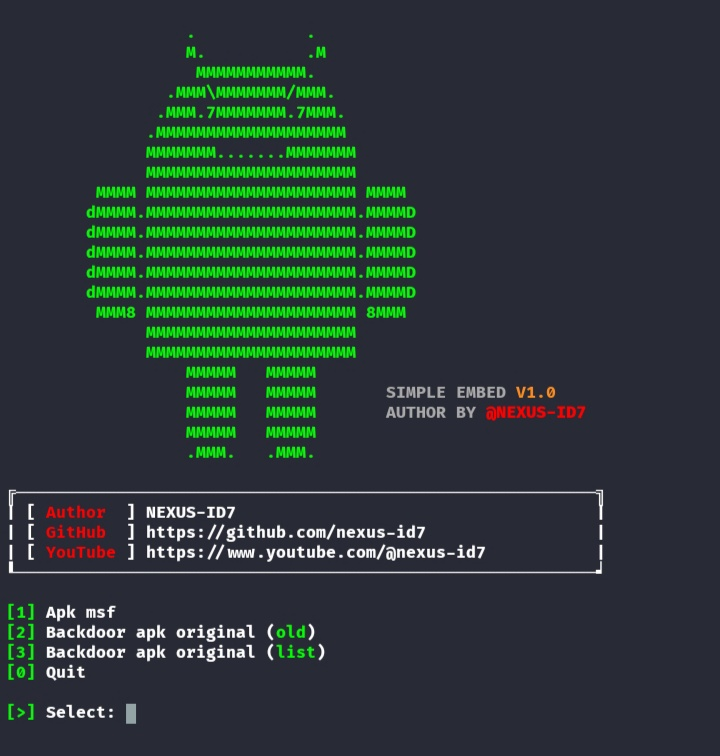

# Simplembed version 1.0
```
       Author by @nexus-id7
```

# Screenshot


# Demo
[](https://asciinema.org/a/596626)

# Dependencies
* <a href="https://github.com/efxtv/Install-Metasploit-Framework-6-in-Termux">Metasploit-Framework</a>
* <a href="https://github.com/iBotPeaches/Apktool">Apktool</a>
* <a href="https://github.com/osm0sis/zipalign">Zipalign</a>
* <a href="https://github.com/fornwall/apksigner">Apksigner</a>
* <a href="https://www.java.com/en/">Java</a>
* <a href="https://www.python.org/downloads/">Python3</a>

# Installer
```
apt install git
git clone https://github.com/nexus-id7/Simplembed.git
cd Simplembed
python3 droidvil.py
```

# Support script
* Only termux v177
* <a href="https://f-droid.org/repo/com.termux_117.apk">Download termux</a>

# Support me
<a href="https://www.youtube.com/nexus-id7">YouTube</a>
